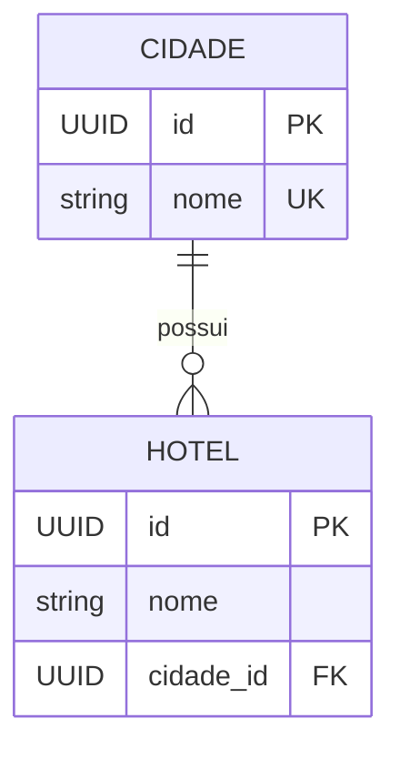

# Modelagem — Cidade e Hotel

## Diagrama

## Cardinalidade

A relação entre Cidade e Hotel é **1:N (um para muitos)**.

- Uma cidade pode possuir zero ou vários hotéis.
- Cada hotel pertence a exatamente uma cidade.

## Decisões de modelagem

### 1. `cidade_id` pode ser nulo?

Não.

Todo hotel deve obrigatoriamente pertencer a uma cidade.

**Decisão:** `cidade_id` será `nullable=False`.

### 2. O que acontece quando uma cidade é excluída?

Será utilizado:

**`ondelete="CASCADE"`**

Ao excluir uma cidade, os hotéis vinculados a ela também serão
excluídos.

Essa decisão segue o padrão utilizado no boilerplate,
onde `Professor` → `Disciplina` utiliza `CASCADE`.

### 3. Duas cidades podem ter o mesmo nome?

Não.

Como o modelo não possui estado ou UF para diferenciar cidades
com o mesmo nome, o campo `nome` de Cidade será:

**`unique=True`**

O nome do Hotel não será único, pois podem existir hotéis com o
mesmo nome em cidades diferentes.

## Chave estrangeira

A chave estrangeira `cidade_id` fica na tabela `hoteis`.

Isso acontece porque a relação é 1:N: uma cidade pode possuir
vários hotéis, enquanto cada hotel pertence a uma única cidade.

Portanto:

**`hoteis.cidade_id` → `cidades.id`**